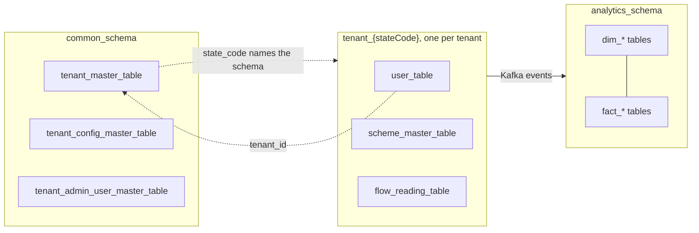
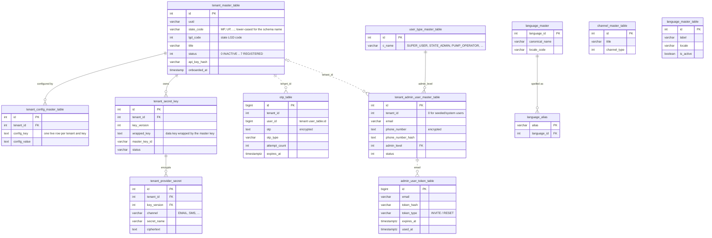

# Entity-Relationship Diagrams

These diagrams show the PostgreSQL schema as left by the Flyway migrations in `backend/database/` (common and tenant schemas, up to V55) and `backend/analytics-service/src/main/resources/db/migration/` (analytics warehouse, up to V55). Table and column descriptions are in [Database Design](database-design.md).

**Reading the diagrams**

* A **solid line** is a foreign key enforced by the database. A **dashed line** is a logical reference the services rely on but the database does not enforce, usually because it crosses schemas or would create a circular dependency.
* Only key and business columns are shown. Most tables also carry `created_at`, `updated_at`, `deleted_at` (soft delete) and `created_by` / `updated_by` / `deleted_by`. Those audit columns reference `common_schema.tenant_admin_user_master_table` or the tenant's `user_table`, and are left out of the diagrams to keep them readable.
* Columns holding PII (names, phone numbers) are encrypted with AES-256 and have an HMAC `*_hash` column beside them for lookups.

## Schema overview

Each state gets its own `tenant_<stateCode>` schema, created by `common_schema.create_tenant_schema()` when the tenant is onboarded. The `analytics_schema` warehouse is filled from Kafka events, not by reading the tenant schemas directly, so there are no database links between it and the other schemas.

## Common schema (`common_schema`)

Shared by every tenant: the tenant registry and its configuration, admin users (Super Users and State Admins), login OTPs, provider secrets and the language catalog.

## Tenant schema (`tenant_<stateCode>`)

One copy per tenant. It holds the tenant's users, location hierarchies, schemes and their assignments, meter readings, anomalies and cached reports.

```mermaid
erDiagram
    user_table {
        int id PK
        varchar uuid
        int tenant_id "common_schema.tenant_master_table"
        int user_type "common_schema.user_type_master_table"
        text title "encrypted name"
        text title_hash
        text phone_number "encrypted"
        text phone_number_hash
        varchar email
        int language_id
        bigint whatsapp_connection_id
        varchar state_user_id "State IT system id"
        int status
    }
    location_config_master_table {
        int id PK
        int region_type "LGD or DEPARTMENT"
        int level
        jsonb level_name
    }
    lgd_location_master_table {
        int id PK
        varchar title
        varchar lgd_code
        varchar state_lgd_id
        int lgd_location_config_id FK
        int parent_id FK
        numeric house_hold_count
    }
    department_location_master_table {
        int id PK
        varchar title
        varchar state_dept_id "State IT system id"
        int department_location_config_id FK
        int parent_id FK
    }
    scheme_master_table {
        int id PK
        varchar uuid
        varchar state_scheme_id "idempotent upload key"
        varchar centre_scheme_id "JJM id"
        varchar state_scheme_code
        varchar scheme_name
        int fhtc_count
        int planned_fhtc
        int house_hold_count
        int channel
        int work_status
        int operating_status
        double k_factor
    }
    scheme_lgd_mapping_table {
        int id PK
        int scheme_id FK
        int parent_lgd_id FK
        varchar parent_lgd_level
    }
    scheme_department_mapping_table {
        int id PK
        int scheme_id FK
        int parent_department_id FK
        varchar parent_department_level
    }
    user_scheme_mapping_table {
        int id PK
        int user_id FK
        int scheme_id FK
        int status
    }
    asset_pump_registry_table {
        int id PK
        int scheme_id FK
        varchar pump_model
        double pump_head
        double pump_discharge_capacity
        double motor_power
        int status
    }
    flow_reading_table {
        int id PK
        varchar uuid
        int scheme_id FK
        int created_by FK "submitting operator"
        timestamp observation_time
        date reading_date
        numeric extracted_reading "OCR value"
        numeric confirmed_reading
        smallint confirmed_reading_source
        numeric quantity
        text image_url
        smallint ingestion_source "lenient-ingestion bitmask"
        smallint quarantine_reason
        varchar correlation_id
    }
    anomaly_table {
        int id PK
        int scheme_id FK
        int user_id FK
        int flow_reading_id FK
        int type
        int status
        int resolved_by FK
        timestamp resolved_at
    }
    notification_table {
        int id PK
        int user_id FK
        text message
        int channel
        boolean seen_status
    }
    data_versions_table {
        varchar resource_type PK
        bigint version
    }
    reports_table {
        uuid id PK
        varchar report_type
        varchar format
        bigint data_version
        varchar object_key "object-storage key"
        int generated_by FK
        timestamptz generated_at
    }
    user_channel_preference {
        bigint id PK
        varchar contact_id "WhatsApp contact, unique"
        varchar channel_value
    }
    user_language_preference {
        bigint id PK
        text contact_id "WhatsApp contact, unique"
        text language_value
    }
    language_master_table {
        int id PK
        varchar language_name
        int preference
        int status
    }

    location_config_master_table ||--o{ lgd_location_master_table : "level of"
    location_config_master_table ||--o{ department_location_master_table : "level of"
    lgd_location_master_table |o--o{ lgd_location_master_table : "parent of"
    department_location_master_table |o--o{ department_location_master_table : "parent of"
    scheme_master_table ||--o{ scheme_lgd_mapping_table : "located in"
    lgd_location_master_table ||--o{ scheme_lgd_mapping_table : "contains"
    scheme_master_table ||--o{ scheme_department_mapping_table : "managed by"
    department_location_master_table ||--o{ scheme_department_mapping_table : "manages"
    user_table ||--o{ user_scheme_mapping_table : "assigned"
    scheme_master_table ||--o{ user_scheme_mapping_table : "operated by"
    scheme_master_table ||--o{ asset_pump_registry_table : "has pumps"
    scheme_master_table ||--o{ flow_reading_table : "readings"
    user_table |o--o{ flow_reading_table : "submits"
    scheme_master_table ||--o{ anomaly_table : "flagged on"
    user_table |o--o{ anomaly_table : "raised for"
    flow_reading_table |o--o{ anomaly_table : "detected in"
    user_table |o--o{ notification_table : "receives"
    user_table |o--o{ reports_table : "generates"
    data_versions_table ||..o{ reports_table : "cache version"
```

`anomaly_table.resolved_by` is a second foreign key to `user_table`, not drawn separately.

## Analytics warehouse (`analytics_schema`)

```mermaid
erDiagram
    dim_tenant_table {
        int tenant_id PK
        varchar state_code
        varchar title
        int status
        int required_lpcd
        int person_count_per_household
        numeric regularity_threshold_percent
    }
    dim_tenant_water_norm_table {
        bigint id PK
        int tenant_id FK
        date effective_from
        date effective_to "SCD type 2"
        int required_lpcd
        int person_count_per_household
    }
    dim_tenant_work_status_filter_table {
        bigint id PK
        int tenant_id
        date effective_from
        date effective_to
        int_array included_work_statuses
    }
    dim_date_table {
        int date_key PK
        date full_date
        int year
        int month
        int week
        int fiscal_year
    }
    dim_lgd_location_table {
        int tenant_id FK
        int lgd_id "unique per tenant"
        varchar title
        int lgd_level
        int level_1_lgd_id "to level_6_lgd_id"
        geometry geom
    }
    dim_department_location_table {
        int tenant_id FK
        int department_id "unique per tenant"
        varchar title
        int department_level
        int level_1_dept_id "to level_6_dept_id"
        geometry geom
    }
    dim_scheme_table {
        int id PK
        int tenant_id FK
        int scheme_id "source scheme id"
        varchar scheme_name
        int parent_lgd_location_id
        int parent_department_location_id
        int work_status
        int operating_status
        int fhtc_count
        int house_hold_count
    }
    dim_user_table {
        bigint id PK
        int tenant_id FK
        int user_id "source user id"
        uuid uuid
        int user_type
        int status
    }
    dim_user_scheme_mapping_table {
        int id PK
        int tenant_id
        int user_id
        int scheme_id
        int status
    }
    fact_meter_reading_table {
        bigint id PK
        int tenant_id FK
        int scheme_id
        int user_id
        numeric extracted_reading
        numeric confirmed_reading
        date reading_date
        timestamp reading_at
        int submission_status
        text correlation_id
    }
    fact_water_quantity_table {
        bigint id PK
        int tenant_id FK
        int scheme_id
        int user_id
        date date FK
        bigint water_quantity
        int submission_status
        varchar outage_reason
    }
    fact_escalation_table {
        bigint id PK
        int tenant_id FK
        int scheme_id
        int user_id
        varchar escalation_type
        int resolution_status
    }
    fact_scheme_performance_table {
        bigint id PK
        int tenant_id FK
        int scheme_id
        numeric performance_score
        date last_water_supply_date
    }
    fact_operator_attendance_table {
        bigint id PK
        int tenant_id FK
        int date_key FK
        int user_id
        int scheme_id
        int attendance
    }
    fact_anomaly_table {
        bigint id PK
        int tenant_id
        int scheme_id
        int user_id
        varchar type
        int status
        text submission_correlation_id
    }
    submission_attempt_table {
        bigint id PK
        int tenant_id
        int scheme_id
        varchar phone_hash
        varchar reason "rejected before a reading was stored"
        timestamp attempted_at
    }
    fact_scheme_daily_table {
        int tenant_id PK
        int scheme_id PK
        date reading_date PK
        int level_1_lgd_id "to level_6, and dept levels"
        smallint submitted
        smallint supplied
        bigint water_supplied_liters
        boolean is_final
    }
    fact_region_metrics_table {
        bigint id PK
        int tenant_id
        varchar period_scale
        date period_start
        varchar hierarchy "LGD or DEPARTMENT"
        int region_id
        int scheme_count
        bigint total_water_supplied_liters
        boolean is_final
    }
    fact_submission_activity_hourly_table {
        bigint id PK
        int tenant_id
        timestamp hour_start
        varchar hierarchy
        int region_id
        int submission_count
    }

    dim_tenant_table ||--o{ dim_tenant_water_norm_table : "norm history"
    dim_tenant_table ||..o{ dim_tenant_work_status_filter_table : "filter history"
    dim_tenant_table ||--o{ dim_lgd_location_table : ""
    dim_tenant_table ||--o{ dim_department_location_table : ""
    dim_tenant_table ||--o{ dim_scheme_table : ""
    dim_tenant_table ||--o{ dim_user_table : ""
    dim_lgd_location_table ||..o{ dim_scheme_table : "parent_lgd_location_id"
    dim_department_location_table ||..o{ dim_scheme_table : "parent_department_location_id"
    dim_user_table ||..o{ dim_user_scheme_mapping_table : "user_id"
    dim_scheme_table ||..o{ dim_user_scheme_mapping_table : "scheme_id"
    dim_scheme_table ||..o{ fact_meter_reading_table : "scheme_id"
    dim_user_table |o..o{ fact_meter_reading_table : "user_id"
    dim_scheme_table ||..o{ fact_water_quantity_table : "scheme_id"
    dim_date_table ||--o{ fact_water_quantity_table : "full_date"
    dim_scheme_table ||..o{ fact_escalation_table : "scheme_id"
    dim_scheme_table ||..o{ fact_scheme_performance_table : "scheme_id"
    dim_scheme_table ||..o{ fact_operator_attendance_table : "scheme_id"
    dim_date_table ||--o{ fact_operator_attendance_table : "date_key"
    dim_scheme_table ||..o{ fact_anomaly_table : "scheme_id"
    dim_scheme_table |o..o{ submission_attempt_table : "scheme_id"
    dim_scheme_table ||..o{ fact_scheme_daily_table : "pre-aggregated per day"
    dim_lgd_location_table ||..o{ fact_region_metrics_table : "region_id (LGD)"
    dim_department_location_table ||..o{ fact_region_metrics_table : "region_id (DEPARTMENT)"
    dim_lgd_location_table ||..o{ fact_submission_activity_hourly_table : "region_id"
```

A star schema owned by analytics-service and filled asynchronously from Kafka. The `*_id` columns (`scheme_id`, `user_id`, `level_N_lgd_id`, ...) carry the source ids from the tenant schema, so joins between facts and dimensions are on `(tenant_id, <source id>)`. Only `tenant_id` and the date keys are enforced foreign keys.

`fact_meter_reading_table`, `fact_water_quantity_table`, `fact_escalation_table`, `fact_scheme_performance_table` and `fact_operator_attendance_table` also have an enforced `tenant_id` foreign key to `dim_tenant_table`, left out of the diagram for readability. `fact_scheme_daily_table`, `fact_region_metrics_table` and `fact_submission_activity_hourly_table` are pre-aggregations rebuilt from the other facts.
