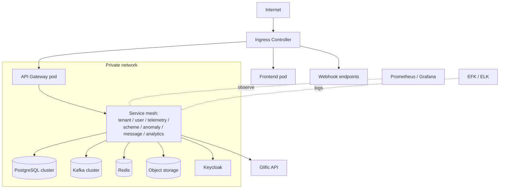

# Deployment Architecture

## 6. Deployment Architecture

### 6.1 Cloud-neutral Principles

The system runs on any **Kubernetes** cluster — on-premises or any cloud provider — without requiring vendor-specific managed services. Infrastructure is provisioned with **Helm** (and optionally **Terraform**), keeping providers pluggable. Services are stateless and scale horizontally; state lives in PostgreSQL, Kafka, Redis, and object storage.

### 6.2 Environments

Three environments share the same topology:

* **dev**
* **staging**
* **prod**

### 6.3 Components

* **Kubernetes** cluster — orchestration for all services
* **PostgreSQL** — operational database (schema-per-tenant) and a separate analytics data warehouse, run highly available (multi-AZ)
* **Apache Kafka** cluster (KRaft mode) — async event bus
* **Redis** — caching and token storage
* **S3-compatible object storage** (MinIO or cloud equivalent) — meter images, escalation PDFs, and file dumps
* **Keycloak** — identity provider
* **Reverse proxy / ingress** — NGINX Ingress or Traefik
* **Prometheus + Grafana** — metrics and dashboards
* **EFK / ELK** — centralised logging

### 6.4 Network Layout

Public ingress is limited to:

* The **API Gateway**
* The **public dashboard frontend**
* The **Glific webhook** endpoints

All internal services and databases run on private networks, with TLS on external endpoints.


Apply rate limiting and other protections at the ingress for the public webhook endpoints.


### 6.5 Deployment Architecture Diagram

### 6.6 Channels — Deployment Considerations

Each input channel ([5.5](technical-architecture.md#5.5-channels)) has its own deployment path and, where a live provider is not yet available, a **mock adapter**:

* **BFM / WhatsApp** — Glific webhook pods behind the ingress
* **Electricity consumption / pump runtime** — batch or API ingestion from state utilities
* **State IT flags** — integration sync jobs
* **IoT devices** — gateway/ingest adapters

For mocks, deploy a dedicated `mocks` namespace with lightweight adapter containers exposing basic Prometheus metrics, so the real services can be exercised end-to-end before live integrations exist.
