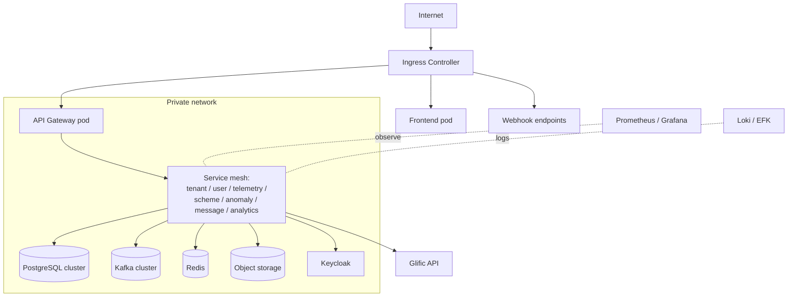

# Deployment Architecture

## 6. Deployment Architecture

### 6.1 Cloud-neutral Principles

The system runs on any **Kubernetes** cluster — on-premises or any cloud provider — without requiring vendor-specific managed services. Infrastructure is provisioned with **Helm** (and optionally **Terraform**), keeping providers pluggable. Services are stateless and scale horizontally; state lives in PostgreSQL, Kafka, Redis, and object storage.

### 6.2 Environments

Three environments share the same topology:

* **dev**
* **staging**
* **prod**

### 6.3 Components

* **Kubernetes** cluster — orchestration for all services
* **PostgreSQL** — operational database (schema-per-tenant) and a separate analytics data warehouse, run highly available (multi-AZ)
* **Apache Kafka** cluster (KRaft mode) — async event bus
* **Redis** — caching and API Gateway rate limiting
* **S3-compatible object storage** (MinIO or cloud equivalent) — meter images, escalation and daily / weekly report PDFs, and file dumps. The report bucket's public base URL must be anonymously readable from wherever the reports are fetched
* **Keycloak** — identity provider
* **Reverse proxy / ingress** — NGINX Ingress or Traefik
* **Prometheus + Grafana** — metrics and dashboards
* **Loki + Promtail** (or EFK / ELK) — centralised logging

### 6.4 Network Layout

Public ingress is limited to:

* The **API Gateway**
* The **public dashboard frontend**
* The **Glific webhook** endpoints (telemetry-service chatbot webhooks, authenticated with `X-Webhook-Token`)

All internal services and databases run on private networks, with TLS on external endpoints.


Apply rate limiting and other protections at the ingress for the public webhook endpoints. The API Gateway adds its own Redis-backed per-route limits when `RATE_LIMIT_ENABLED` is set (off by default).


### 6.5 Deployment Architecture Diagram

```mermaid
graph TD
    NET[Internet] --> ING[Ingress Controller]
    ING --> GWP[API Gateway pod]
    ING --> FEP[Frontend pod]
    ING --> WHP[Webhook endpoints]
    subgraph Private network
        GWP --> MESH[Service mesh:<br/>tenant / user / telemetry /<br/>scheme / anomaly / message / analytics]
        MESH --> PG[(PostgreSQL cluster)]
        MESH --> KAF[(Kafka cluster)]
        MESH --> RED[(Redis)]
        MESH --> OBJ[(Object storage)]
        MESH --> KC[Keycloak]
    end
    MESH --> GLIFIC[Glific API]
    MON[Prometheus / Grafana] -. observe .- MESH
    LOG[Loki / EFK] -. logs .- MESH
```

### 6.6 Channels — Deployment Considerations

Each input channel ([5.5](technical-architecture.md#5.5-channels)) has its own deployment path and, where a live provider is not yet available, a **mock adapter**:

* **BFM / WhatsApp** — Glific flow webhooks served by telemetry-service, behind the ingress
* **Electricity consumption / pump runtime** — ingestion from state utilities through the telemetry reading API (`X-Api-Key`)
* **State IT systems** — push readings through the same telemetry reading API
* **IoT devices** — gateway/ingest adapters

For mocks, deploy a dedicated `mocks` namespace with lightweight adapter containers exposing basic Prometheus metrics, so the real services can be exercised end-to-end before live integrations exist.

### 6.7 Build & Release

Each service has its own GitHub Actions workflow (`.github/workflows/Image-*.yaml`), triggered by changes under that service's `backend/<service>/` directory:

* **SonarQube** scan with JaCoCo coverage on every pull request and push
* On `dev` and `main`, a Docker image built from the shared `build/maven/Dockerfile` (Java 21) and pushed to the container registry, tagged with the commit SHA
* **Trivy** vulnerability scan of the pushed image
* Deployment through the separate DevOps repository's deploy workflow — `dev` branch → **dev**, `main` branch → **staging**

A repository-wide **vendor-neutrality guard** (`.github/workflows/vendor-neutrality-guard.yaml`) fails any change that introduces a vendor or state name outside the places its rules allow.
