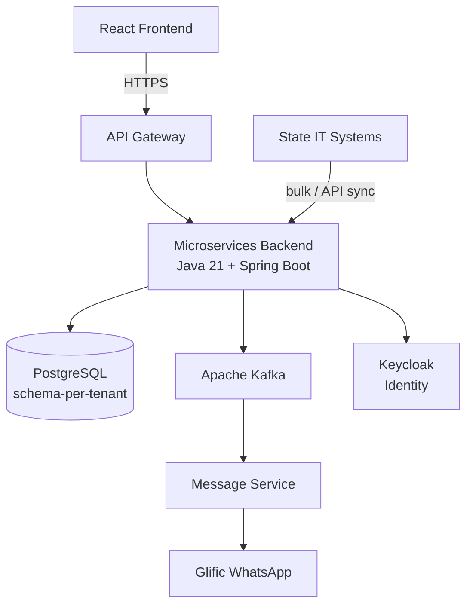
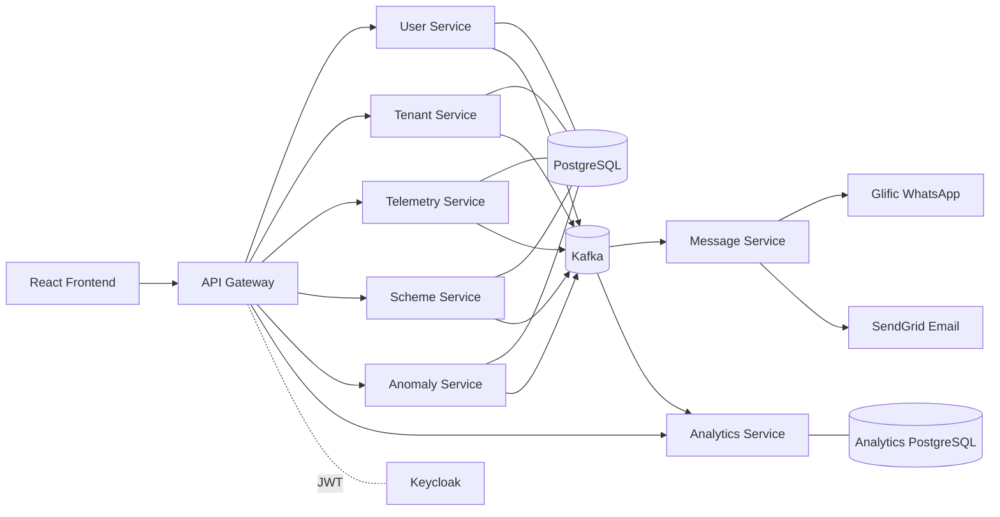

# Technical Architecture

## 5. Technical Architecture

### 5.0 Software Architecture Diagram

### 5.1 Architectural Style

* **Microservices** backend in **Java 21 + Spring Boot 3.2.5**, one service per bounded domain
* **Mono-repo** structure under `backend/`, with a directory per service (`api-gateway`, `service-discovery`, `tenant-service`, `user-service`, `telemetry-service`, `scheme-service`, `anomaly-service`, `message-service`, `analytics-service`)
* **Synchronous** inter-service calls over HTTP, with **Netflix Eureka** service discovery (services call each other by logical name)
* **Asynchronous** communication over **Apache Kafka** (KRaft mode) — event notifications and decoupling between producers and consumers
* **Schema-per-tenant** multi-tenancy on PostgreSQL
* **Keycloak** for identity and access management; every service is an OAuth2 resource server validating JWTs

### 5.2 Key Backend Services



### API Gateway / Edge

Single public entry point (Spring Cloud Gateway, reactive). Validates the Keycloak JWT at the edge, rejects unauthenticated requests, and routes by path prefix to the correct service.



### Service Discovery

Netflix Eureka registry. All services register on startup and discover each other by logical name, enabling load balancing and location transparency.



### Tenant Service

The control plane: onboards state tenants and provisions their schemas, manages per-tenant configuration and location hierarchies, and runs the daily **nudge / escalation schedulers**.



### User Service

Authentication and user lifecycle: email + password and WhatsApp-OTP login, refresh-token rotation with DB-backed revocation, staff invitations, and **PII encryption** for names and phone numbers.



### Telemetry Service

Field-data ingestion. Hosts the **Glific flow webhooks** for the WhatsApp submission journey, calls **FlowVision AI** to extract the meter reading, validates it, and publishes a reading event.



### Scheme Service

Manages water-supply schemes and their LGD / departmental location mappings, with bulk upload and filterable, paginated queries for dashboards.



### Anomaly Service

Evaluates readings and submissions against anomaly rules (missed submissions, implausible jumps, outages) and records detected anomalies for dashboards and escalations.



### Message Service

Notification delivery across **WhatsApp (Glific), email (SendGrid), and SMS**. Generates escalation **PDF reports**, uploads them to object storage, and sends them as WhatsApp documents. Uses a non-blocking HTTP client for outbound calls.



### Analytics Service

Consumes events from all services into a dedicated **star-schema data warehouse** and serves read-only BI/query APIs for scheme, state, and national dashboards.



### 5.3 Data Flow Examples

**Field submission via WhatsApp**

1. Operator opens the JalSoochak WhatsApp flow via Glific and submits a meter photo
2. Glific calls the **telemetry-service flow webhooks** at each step of the conversation
3. Telemetry calls **FlowVision AI** → extracted reading + confidence score
4. The operator confirms (high confidence) or enters the value manually (low confidence)
5. The reading is validated and persisted; a reading event is published to Kafka
6. Analytics consumes the event and updates the data warehouse — dashboards reflect it in near-real-time

**Admin configuration update**

1. State Admin updates configuration (e.g. water norm, escalation threshold) via the gateway
2. Tenant Service persists the change to the tenant's configuration store
3. A tenant event is published to Kafka
4. Downstream consumers (e.g. analytics) sync the relevant dimension/state

### 5.4 Technical Architecture Diagram

### 5.5 Channels

Readings and supply signals can arrive through multiple input channels:

* **BFM reading** (Bulk Flow Meter photo over WhatsApp) — the primary channel
* **Electricity consumption**
* **Pump runtime / duration**
* **Inform-basis** flags from State IT systems
* **IoT devices**


Non-WhatsApp channels are modelled in the data layer and can be enabled per tenant. Where a live integration is not yet available, lightweight **mock adapters** stand in, kept behind feature flags so they can be swapped for real providers without code changes elsewhere.

