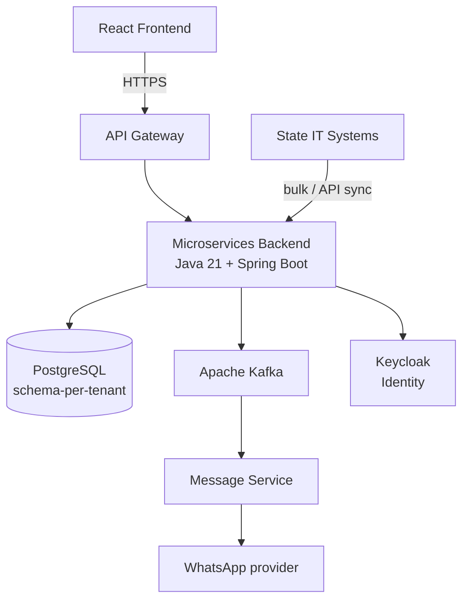
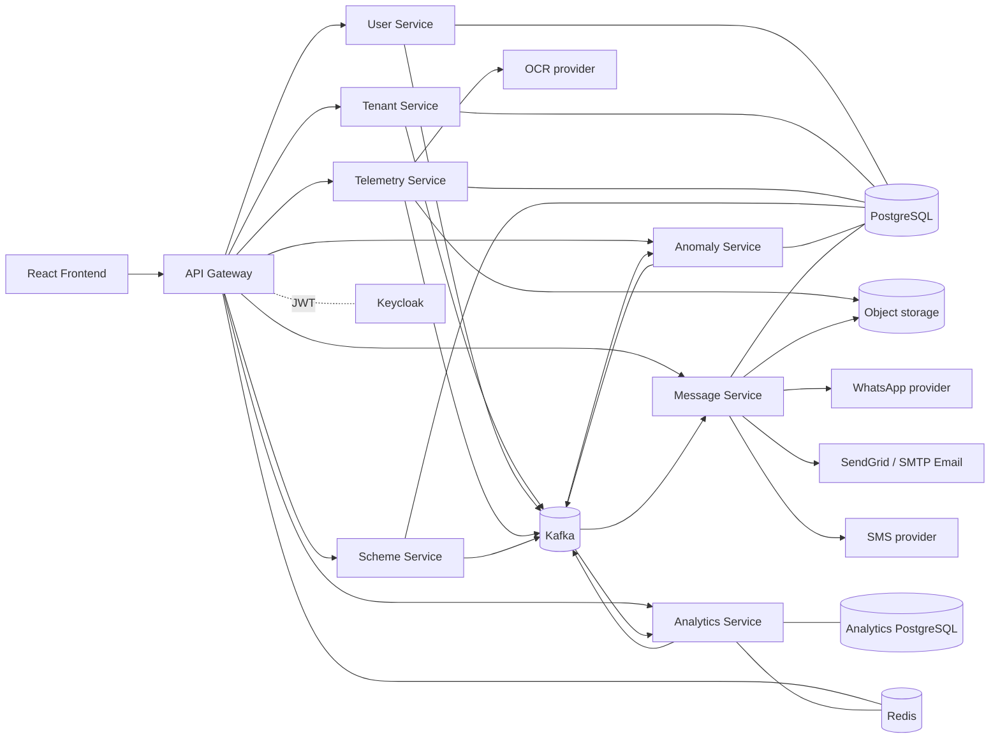

# Technical Architecture

## 5. Technical Architecture

### 5.0 Software Architecture Diagram

```mermaid
graph TD
    FE[React Frontend] -->|HTTPS| GW[API Gateway]
    GW --> SVC[Microservices Backend<br/>Java 21 + Spring Boot]
    SVC --> DB[(PostgreSQL<br/>schema-per-tenant)]
    SVC --> K[Apache Kafka]
    K --> MSG[Message Service]
    MSG --> WA[WhatsApp provider]
    SVC --> KC[Keycloak<br/>Identity]
    EXT[State IT Systems] -->|bulk / API sync| SVC
```

### 5.1 Architectural Style

* **Microservices** backend in **Java 21 + Spring Boot 3.2.5**, one service per bounded domain
* **Mono-repo** structure under `backend/`, with a directory per service (`api-gateway`, `service-discovery`, `tenant-service`, `user-service`, `telemetry-service`, `scheme-service`, `anomaly-service`, `message-service`, `analytics-service`)
* **Synchronous** client traffic over HTTP through the API Gateway, which routes each path prefix to a configured service URI; services can register with **Netflix Eureka** (`EUREKA_ENABLED`, off by default) but do not call one another directly — they share the PostgreSQL database and exchange events over Kafka
* **Asynchronous** communication over **Apache Kafka** (KRaft mode) — each service produces to its own `<service-name>-topic`; scheduled notification events travel on `common-topic`
* **Schema-per-tenant** multi-tenancy on PostgreSQL
* **Keycloak** for identity and access management; the gateway and every service except telemetry-service are OAuth2 resource servers validating JWTs (telemetry authenticates its callers with a webhook token or an API key instead)

### 5.2 Key Backend Services



### API Gateway / Edge

Single public entry point (Spring Cloud Gateway, reactive). Validates the Keycloak JWT at the edge, rejects unauthenticated requests to anything a service does not publish itself, applies Redis-backed per-route rate limits (tightest on login and OTP), and routes by path prefix to the correct service.



### Service Discovery

Netflix Eureka registry. Services register on startup when `EUREKA_ENABLED` is set; the gateway routes to configured service URIs rather than through registry lookups, so the registry is optional in a deployment.



### Tenant Service

The control plane: onboards state tenants and provisions their schemas, manages per-tenant configuration and location hierarchies, and runs the per-tenant **nudge, escalation, daily report and weekly report schedulers** (cron times configured per tenant, in IST).



### User Service

Authentication and user lifecycle: email + password and OTP login (over WhatsApp or SMS), refresh-token rotation with DB-backed revocation, staff invitations, and **PII encryption** for names and phone numbers.



### Telemetry Service

Field-data ingestion. Hosts the **chatbot flow webhooks** for the WhatsApp submission journey, calls the **OCR provider** to extract the meter reading, validates it (including supply-plausibility and location-affinity checks), and publishes a reading event. Also serves an API-key–authenticated **reading API** for state IT systems and other channels.



### Scheme Service

Manages water-supply schemes and their LGD / departmental location mappings, with bulk upload and filterable, paginated queries for dashboards.



### Anomaly Service

Anomaly rules are evaluated where the data arrives — telemetry-service at reading time (unreadable image, reading below the previous one, duplicate image, no / low / over / implausible supply, location mismatch) and tenant-service for missed submissions during the escalation run. Each anomaly is written to the tenant's `anomaly_table` and published as an `ANOMALY_RECORDED` event for the dashboards. The anomaly service itself is currently lightweight: it syncs user and scheme dimensions from Kafka into the analytics schema.



### Message Service

Notification delivery across **WhatsApp, email (SendGrid or SMTP), and SMS**, with email and SMS providers selectable per tenant. WhatsApp goes through the provider-neutral `WhatsAppSender` port (adapter: `GlificWhatsAppSender`). Generates escalation and daily / weekly situation **PDF reports**, uploads them to object storage, and delivers them over WhatsApp — escalations as documents, daily reports as a document or a "View Report" link button (`NOTIFICATIONS_DAILY_REPORT_DELIVERY_MODE`, `LINK` by default), and weekly reports as a link only. Uses a non-blocking HTTP client for outbound calls.



### Analytics Service

Consumes events from all services into a dedicated **star-schema data warehouse** and serves read-only BI/query APIs for scheme, state, and national dashboards, with Redis caches warmed on a schedule. Also computes the KPIs for the daily and weekly situation reports on request.



### 5.3 Data Flow Examples

**Field submission via WhatsApp**

1. Operator opens the JalSoochak WhatsApp flow and submits a meter photo
2. The WhatsApp provider calls the **telemetry-service flow webhooks** at each step of the conversation
3. Telemetry calls the **OCR provider** → extracted reading + confidence score
4. The operator confirms (high confidence) or enters the value manually (low confidence)
5. The reading is validated and persisted; a reading event is published to Kafka (any anomaly found along the way is recorded and published as well)
6. Analytics consumes the event and updates the data warehouse — dashboards reflect it in near-real-time

**Admin configuration update**

1. State Admin updates configuration (e.g. water norm, escalation threshold) via the gateway
2. Tenant Service persists the change to the tenant's configuration store and reschedules the tenant's jobs
3. A `TENANT_CONFIG_UPDATED` event is published to `tenant-service-topic`
4. Downstream consumers (e.g. analytics, telemetry, message service) sync the relevant dimension/state or evict their cached config

**Scheduled notifications**

1. Tenant Service's per-tenant crons publish `NUDGE` and `ESCALATION` events, and `DAILY_REPORT_REQUEST` / `WEEKLY_REPORT_REQUEST` events per officer, to `common-topic`
2. For report requests, Analytics computes the officer's KPIs and publishes `DAILY_REPORT_KPIS` / `WEEKLY_REPORT_KPIS` back to `common-topic`
3. Message Service routes each event, renders any PDF, uploads it to object storage, and sends the localized template through the `WhatsAppSender` port

### 5.4 Technical Architecture Diagram

```mermaid
graph LR
    FE[React Frontend] --> GW[API Gateway]
    GW --> US[User Service]
    GW --> TN[Tenant Service]
    GW --> TE[Telemetry Service]
    GW --> SC[Scheme Service]
    GW --> AN[Anomaly Service]
    GW --> AL[Analytics Service]
    GW --> MS[Message Service]
    GW --- RD[(Redis)]
    US --- DB[(PostgreSQL)]
    TN --- DB
    TE --- DB
    SC --- DB
    AN --- DB
    MS --- DB
    TN --> KA[(Kafka)]
    US --> KA
    TE --> KA
    SC --> KA
    AN --> KA
    AL --> KA
    KA --> MS
    KA --> AL
    KA --> AN
    AL --- DW[(Analytics PostgreSQL)]
    AL --- RD
    TE --> OCR[OCR provider]
    TE --> OBJ[(Object storage)]
    MS --> OBJ
    MS --> WA[WhatsApp provider]
    MS --> SG[SendGrid / SMTP Email]
    MS --> SMS[SMS provider]
    GW -. JWT .- KC[Keycloak]
```

### 5.5 Channels

Readings and supply signals can arrive through multiple input channels:

* **BFM reading** (Bulk Flow Meter photo over WhatsApp) — the primary channel
* **Electricity consumption** (ELM)
* **Pump runtime / duration** (PDU)
* **IoT devices** (IOT)
* **Manual entry** (MAN)
* **State IT systems**, pushing readings through the telemetry reading API


Non-WhatsApp channels are modelled in the data layer and can be enabled per tenant (channel codes `BFM`, `ELM`, `PDU`, `IOT`, `MAN`). External systems submit through the API-key–authenticated telemetry reading API, which accepts a canonical request or a registered per-format mapping, so a new source can be onboarded without code changes elsewhere.

