# User Manual for Sub Divisional Officers and Section Officers

**Version:** 1.0

**Audience:** Sub Divisional Officer & Section Officer

**Table of Contents**

* **1. Getting Started**
  * 1.1 Logging In
  * 1.2 Resend OTP
* **2. Navigation Overview**
* **3. Overview Page**
  * 3.1 KPI Cards
  * 3.2 Date Range Filter
  * 3.3 Analytics Charts
* **4. Schemes**
  * 4.1 Schemes List
  * 4.2 Scheme Detail View
* **5. Pump Operators**
  * 5.1 Pump Operators List
  * 5.2 Pump Operator Detail View
  * 5.3 Download Attendance
* **6. Anomalies**
* **7. Escalations**
* **8. Appendix: Common UI Patterns**

## 1. Getting Started

### 1.1 Logging In

**Route:** `/staff/login`

Section Officers log in using their **registered phone number** and a **one-time password (OTP)**.

**Step 1 — Enter your phone number and state**

1. Open the JalSoochak web application URL in your browser.
2. Enter your **10-digit mobile number** in the Phone Number field.
   * Only digits are accepted; any other character is ignored automatically.
3. Select your **State / UT** from the dropdown.
4. Click **Send OTP**.

**Step 2 — Enter the OTP**

After a successful OTP request, the screen changes to the OTP entry step.

1. The subtitle confirms where the OTP was sent, for example: *"Enter the 6-digit code we sent on +91 \*\*\*\*\*0960."* The last four digits of your phone number are visible; the rest are masked.
2. Enter each digit of the OTP in the individual boxes displayed on screen.
   * The number of boxes matches the OTP length (typically 6 digits).
   * Focus moves automatically to the next box as you type each digit.
   * You can also **paste** the entire OTP at once — all boxes fill in automatically.
   * Press **Backspace** to clear a digit and move back to the previous box.
3. Once all digits are filled, click **Log in**.
   * The button shows **"Logging in…"** while verifying.
   * If the OTP is wrong, the message *"Invalid OTP. Please try again."* is shown and the boxes are cleared so you can re-enter.
4. On success, you are redirected to the Overview page (/staff).

**To go back to Step 1** (e.g., to correct your phone number), click the **← Back** link at the top of the OTP screen.

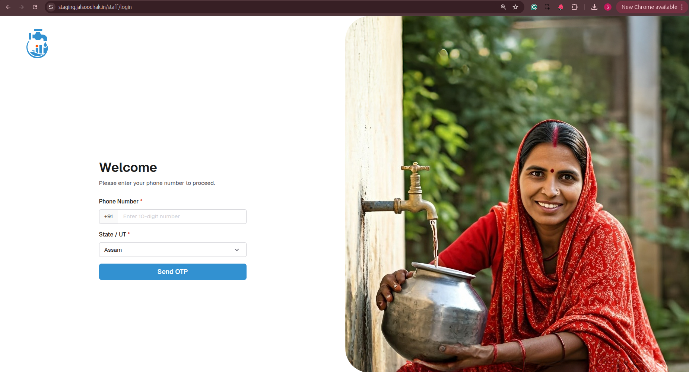

### 1.2 Resend OTP

If you do not receive the OTP:

1. Wait for the **60-second countdown** shown as *"Resend in Xs"* to expire.
2. Once the countdown reaches zero, the **Resend** link becomes active.
3. Click **Resend**. The link shows **"Sending…"** while the new OTP is dispatched.
4. If resending fails, the message *"Failed to resend OTP. Please try again."* is shown.

> **Note:** *If you do not receive the OTP after resending, check that the phone number and State/UT selected in Step 1 are correct. Use the **← Back** link to correct them.*

## 2. Navigation Overview

After logging in, the left sidebar provides access to all Section Officer sections:

| Sidebar Item       | Description                                                  |
| ------------------ | ------------------------------------------------------------ |
| **Overview**       | KPI summary cards and six analytics charts for your section  |
| **Schemes**        | Browse all water schemes in your section                     |
| **Pump Operators** | View and monitor field pump operators                        |
| **Anomalies**      | Track flagged data anomalies across your schemes             |
| **Escalations**    | Monitor escalated issues within your section                 |

## 3. Overview Page

**Route:** `/staff`

The Overview is the landing page after login. It shows a summary of your section's activity.

### 3.1 KPI Cards

Four summary cards are displayed at the top:

| Card                    | What It Shows                              | Action on Click                 |
| ----------------------- | ------------------------------------------ | ------------------------------- |
| Total No. of Schemes    | Total schemes assigned to you              | None — read-only                |
| Quantity Supplied (MLD) | Total water supplied in megalitres per day | None — read-only                |
| Anomalies Flagged       | Total number of flagged anomalies          | Navigates to the Anomalies page |
| Escalations             | Total number of active escalations         | Navigates to the Escalations page |

> **Tip:** *Click the **Anomalies Flagged** or **Escalations** cards to go directly to those pages.*

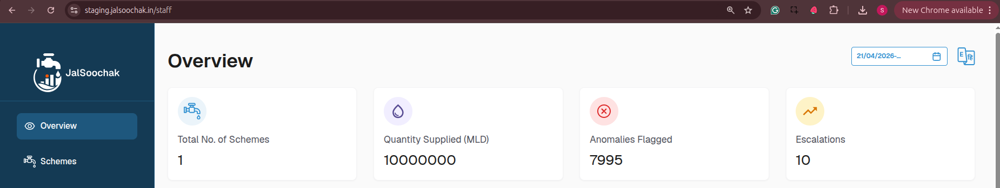

### 3.2 Date Range Filter

A **Date Range Picker** is located in the top-right of the Overview page.

* Controls the data shown in **all six charts** simultaneously.
* Default range: **last 30 days**.
* Click the picker, select a start date and end date from the calendar, and all charts refresh automatically.

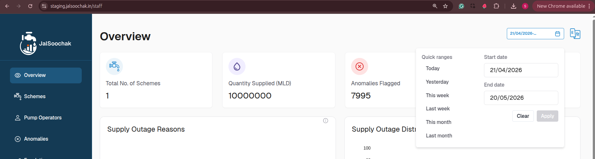

### 3.3 Analytics Charts

Six charts are displayed in a two-column grid below the KPI cards. All charts reflect the date range selected by the Date Range Filter.

| Chart Title                 | Type       | What It Shows                                         |
| --------------------------- | ---------- | ----------------------------------------------------- |
| Supply Outage Reasons       | Pie chart  | Breakdown of supply outages by reported reason        |
| Supply Outage Distribution  | Line chart | Trend of supply outages over the selected date range  |
| Non-Submission Reasons      | Pie chart  | Breakdown of missed submissions by reason             |
| Non-Submission Distribution | Line chart | Trend of non-submissions over the selected date range |
| Reading Submission Status   | Pie chart  | Split between compliant and anomalous submissions     |
| Reading Submission Rate     | Bar chart  | Submission rate trends over the selected date range   |

If a chart fails to load, the message *"Failed to load data"* is shown inside the chart area.

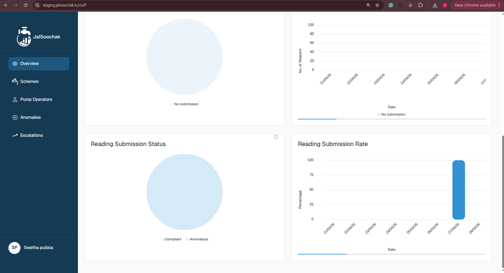

## 4. Schemes

### 4.1 Schemes List

**Route:** `/staff/schemes`

Displays all water schemes assigned to your section.

**Searching Schemes**

* Use the **Search by scheme name** box at the top of the page.
* Results filter as you type
* Clear the box to show all schemes again.

**Schemes Table**

| Column              | Description                                                                   |
| ------------------- | ----------------------------------------------------------------------------- |
| Scheme Name         | Full name of the scheme; hover to see the complete name if it is truncated    |
| State Scheme ID     | The state-assigned identifier for the scheme                                  |
| Pump Operators      | Operators assigned to the scheme; hover over **+N more** to see the full list |
| Last Reading        | Most recent meter reading value                                               |
| Yesterday's Reading | Meter reading from the previous day                                           |
| Last Water Supplied | Most recent water quantity supplied; shown as **—** if unavailable            |
| Last Submission     | Date and time of the last reading submission; shown as **—** if none exists   |
| Actions             | Eye icon — click to open the scheme's detail view                             |

* Click any column header to sort ascending; click again for descending.
* Use the rows-per-page selector **(10 / 25 / 50)** and the pagination arrows at the bottom to navigate pages.
* If no schemes match the search, the message *"No schemes found."* is displayed.
* If data fails to load, *"Failed to load schemes. Please try again."* is shown with a **Retry** button.

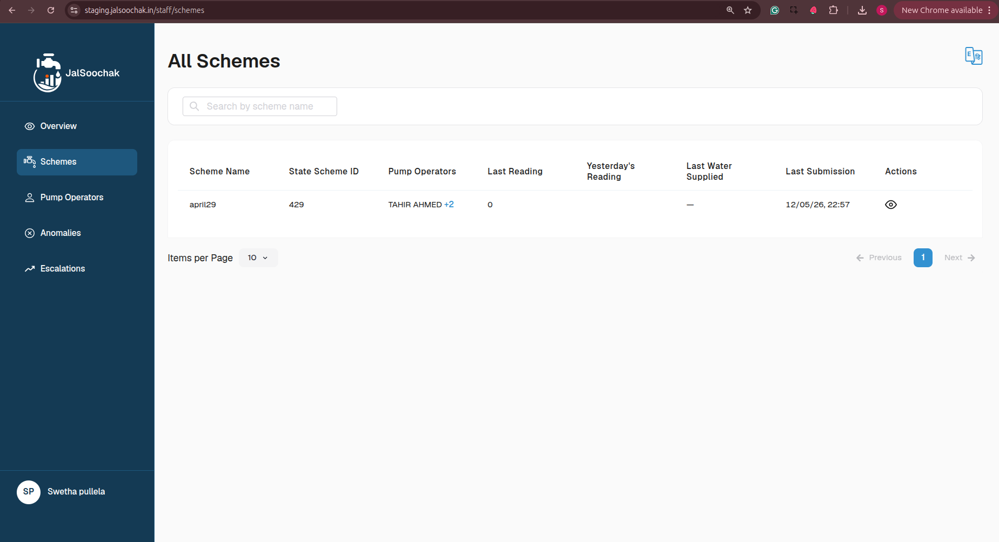

### 4.2 Scheme Detail View

**Route:** `/staff/schemes/:schemeId`

Opens when you click the eye icon on a scheme row.

**Breadcrumb Navigation**

At the top of the page: **All Schemes / View Scheme**. Click **All Schemes** to return to the schemes list.

**Scheme Details**

Displayed in a two-column card:

| Field           | Description                                                          |
| --------------- | -------------------------------------------------------------------- |
| Scheme Name     | Full name of the scheme                                              |
| State Scheme ID | State-assigned identifier                                            |
| Last Submission | Date and time of the most recent submission; shown as **—** if none |
| Reporting Rate  | Percentage of expected submissions that were received                |

**Reading Submissions Table**

Shows all operator submissions for this scheme.

| Column                 | Description                                                                         |
| ---------------------- | ----------------------------------------------------------------------------------- |
| Pump Operator          | Name of the submitting operator; click the name to open that operator's detail page |
| Submission Date & Time | When the reading was submitted                                                      |
| Water Supplied         | Volume of water supplied                                                            |
| Reading Value          | Meter reading value recorded                                                        |

* Pagination: 10 / 25 / 50 rows per page.
* If no submissions exist: *"No submissions found."*
* If data fails to load: *"Failed to load reading submissions."* with a **Retry** button.

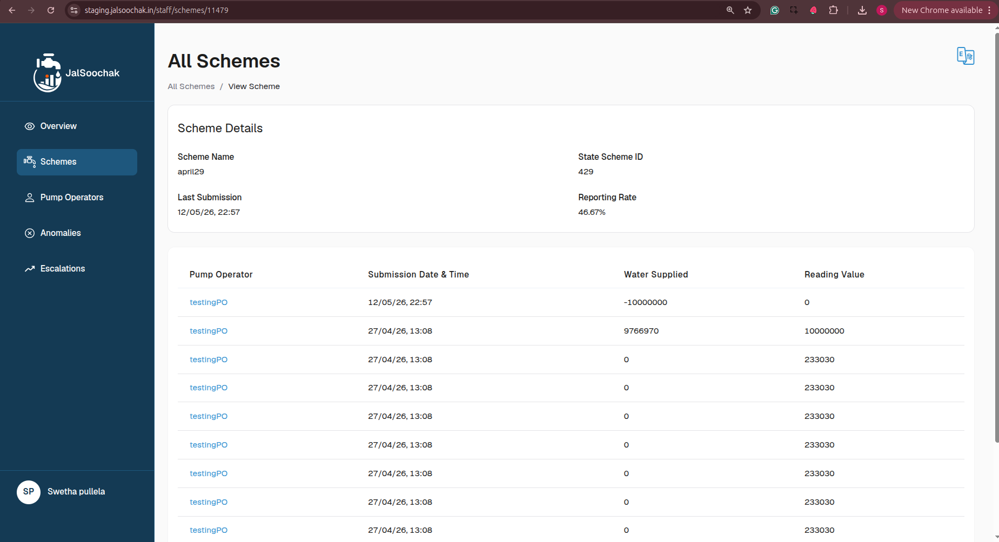

## 5. Pump Operators

### 5.1 Pump Operators List

**Route:** `/staff/pump-operators`

Displays all pump operators assigned to the schemes under you.

**Filters**

| Filter            | How to Use                                                                                   |
| ----------------- | -------------------------------------------------------------------------------------------- |
| Search by name    | Type an operator's full name to see the results                                              |
| Status            | Select **Active** or **Inactive** from the dropdown                                          |
| Duration          | Click the date range field and select a start and end date to filter by last submission date |
| clear all filters | Appears when any filter is active; click to reset all filters at once                        |

**Pump Operators Table**

| Column             | Description                                                                |
| ------------------ | -------------------------------------------------------------------------- |
| Name               | Operator's full name; hover for full name if truncated                     |
| Schemes            | Assigned schemes; hover over **+N more** to see all schemes                |
| Reporting Rate (%) | Percentage of expected submissions received; shown as **—** if unavailable |
| Water Supplied     | Most recent water supply quantity; shown as **—** if unavailable           |
| Last Submission    | Date and time of the last submission; shown as **—** if none               |
| Activity Status    | **Active** (green chip) or **Inactive** (grey chip)                        |
| Actions            | Eye icon — click to open the operator's detail view                        |

* Sortable columns; pagination: 10 / 25 / 50 rows per page.
* If no operators match: *"No pump operators found."*
* If data fails to load: *"Failed to load pump operators. Please try again."* with a **Retry** button.

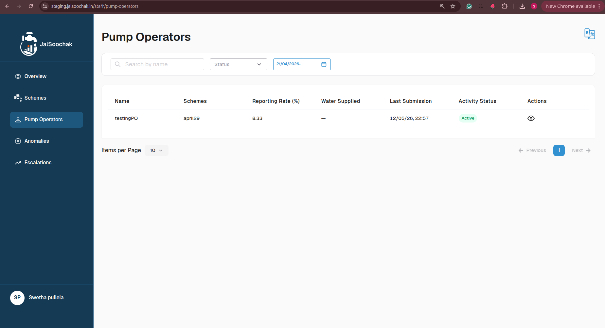

### 5.2 Pump Operator Detail View

**Route:** `/staff/pump-operators/:operatorId`

Opens when you click the eye icon on an operator row.

**Breadcrumb Navigation**

At the top of the page: **Pump Operators / View Pump Operator**. Click **Pump Operators** to return to the list.

**Operator Details**

Displayed in a four-column card:

| Field           | Description                                                          |
| --------------- | -------------------------------------------------------------------- |
| Name            | Operator's full name                                                 |
| Phone Number    | Registered phone number                                              |
| Reporting Rate  | Percentage of expected submissions received                          |
| Last Submission | Date and time of the most recent submission; shown as **—** if none |

**Readings Table**

Shows all readings submitted by this operator.

Use the **Search by scheme name** box above the table to filter readings by a specific scheme.

| Column                 | Description                                                                               |
| ---------------------- | ----------------------------------------------------------------------------------------- |
| Scheme Name            | Name of the scheme the reading was submitted for; click to open that scheme's detail page |
| State Scheme ID        | State-assigned identifier for the scheme                                                  |
| Submission Date & Time | When the reading was submitted                                                            |
| Water Supplied         | Volume supplied; shown as **—** if unavailable                                            |
| Reading Value          | Meter reading value recorded                                                              |

* Pagination: 10 / 25 / 50 rows per page.
* If no readings exist: *"No readings found."*
* If data fails to load: *"Failed to load readings."* with a **Retry** button.

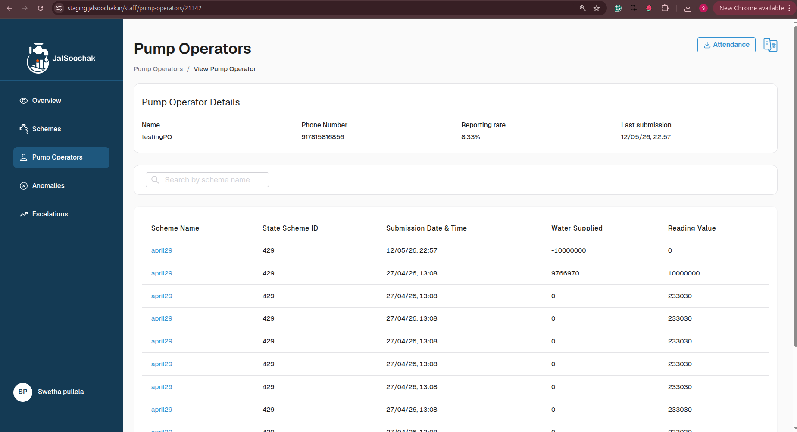

### 5.3 Download Attendance

The **Attendance** download button is located in the top-right corner of the Pump Operator Detail View page.

**Steps:**

1. Click the **Attendance** button (download icon + text) in the page header.
2. The **Download Attendance** modal opens.
3. Under **Select Duration**, click the date range field and choose a start and end date.
   * Default range: the 30 days prior to yesterday.
   * Both a start date and an end date must be selected before the Download button activates.
4. Click **Download** to generate and save the CSV file.
   * The file is saved with the filename: `{operator_name}_attendance.csv`.
5. Click **Cancel** to close the modal without downloading.

**CSV file structure:**

| Row           | Content                                                                    |
| ------------- | -------------------------------------------------------------------------- |
| Row 1         | Name label — operator's name                                               |
| Row 2         | Phone Number label — operator's phone number                               |
| Row 3         | *(blank)*                                                                  |
| Row 4         | Column headers: Date \| Attendance                                         |
| Row 5 onwards | Each date in the range with its attendance value (1 = present, 0 = absent) |

> **Note:** *The **Download** button is disabled until both dates are selected. The **Cancel** button is also disabled while the file is being generated.*

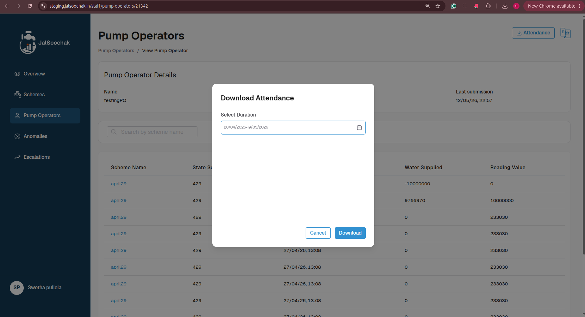

## 6. Anomalies

**Route:** `/staff/anomalies`

Displays data anomalies flagged across your section's schemes.

**Filters**

| Filter                | How to Use                                                                             |
| --------------------- | -------------------------------------------------------------------------------------- |
| Search by scheme name | Type a scheme name; results filter as you type                                         |
| Status                | Select a status from the dropdown (options are loaded from the system)                 |
| Duration              | Select a date range to filter by when anomalies were detected; default: last 30 days  |
| clear all filters     | Appears when any filter is active; click to reset all filters at once                  |

**Anomalies Table**

| Column       | Description                                                                            |
| ------------ | -------------------------------------------------------------------------------------- |
| Scheme Name  | Name of the affected scheme; hover for full name if truncated                          |
| Date & Time  | When the anomaly was detected                                                          |
| Anomaly Type | Category of the anomaly (e.g., Missing Reading, Low Reading)                           |
| Details      | Description or reason; hover for full text if truncated                                |
| Status       | Current status of the anomaly; colour-coded chip (e.g., Open, Under Review, Resolved) |

* Pagination: 10 / 25 / 50 rows per page.
* If no anomalies match: *"No anomalies found."*
* If data fails to load: *"Failed to load anomalies. Please try again."* with a **Retry** button.

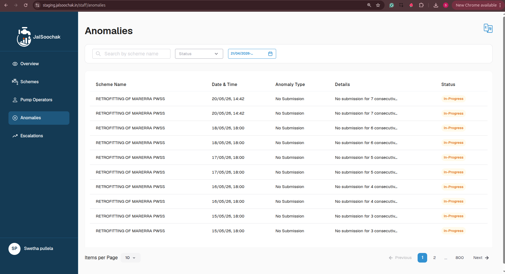

## 7. Escalations

**Route:** `/staff/escalations`

Displays issues that have been escalated within your section.

**Filters**

| Filter                | How to Use                                                                              |
| --------------------- | --------------------------------------------------------------------------------------- |
| Search by scheme name | Type a scheme name; results filter as you type                                          |
| Status                | Select a status from the dropdown (options are loaded from the system)                  |
| Duration              | Select a date range to filter by when escalations were created; default: last 30 days  |
| clear all filters     | Appears when any filter is active; click to reset all filters at once                   |

**Escalations Table**

| Column          | Description                                                                           |
| --------------- | ------------------------------------------------------------------------------------- |
| Scheme Name     | Name of the affected scheme; hover for full name if truncated                         |
| Date & Time     | When the escalation was raised                                                        |
| Escalation Type | Category (e.g., Non-Submission, Supply Outage)                                        |
| Details         | Description or message; hover for full text if truncated                              |
| Status          | Current resolution status; colour-coded chip (e.g., Pending, In Progress, Resolved) |

* Pagination: 10 / 25 / 50 rows per page.
* If no escalations match: *"No escalations found."*
* If data fails to load: *"Failed to load escalations. Please try again."* with a **Retry** button.

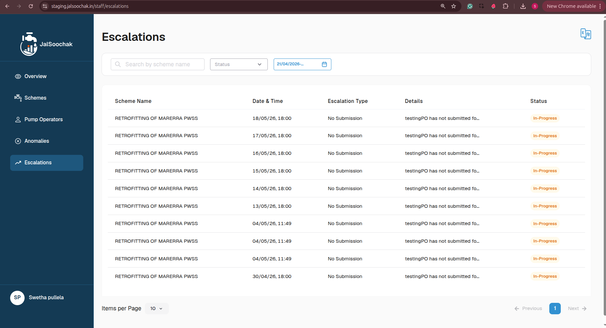

## 8. Appendix: Common UI Patterns

**Date Range Picker**

Used on the Overview page (for charts) and in the filter toolbars on the Pump Operators, Anomalies, and Escalations pages, and in the Attendance download modal.

1. Click the date range field.
2. A calendar popover opens.
3. Click the **start date**, then click the **end date**.
4. The data or charts update automatically.

The default range is the **last 30 days** unless otherwise stated.

**Search Filters**

All search boxes use a **400 ms delay** before applying the filter. This avoids unnecessary requests while you are still typing. Clearing the search box restores the full list.

Changing a search or filter always resets the table back to **page 1**.

**Table Controls**

* Click a **column header** to sort ascending; click again for descending.
* The **rows-per-page selector** (10 / 25 / 50) and **page navigation arrows** are at the bottom of every table.

**Clear All Filters**

The **clear all filters** link appears in the filter toolbar as soon as any filter — search text, status, or date range — is active. Clicking it resets every filter on that page simultaneously.

**Hover Tooltips**

Long text values in table cells (scheme names, operator names, anomaly details) are truncated with **…**. Hover over the cell to read the complete text in a tooltip.

**Popover Lists**

Columns that can hold multiple values — such as Pump Operators on the Schemes list or Schemes on the Pump Operators list — show the first value and a **+N more** badge. Hover over the badge to see the full list in a popover.

**Loading, Empty, and Error States**

* A **spinner** is shown whenever data is being fetched from the server.
* If data fails to load, an **error message** is displayed with a **Retry** button.
* If a search or filter returns no results, an **empty state message** is shown (e.g., *"No schemes found."*).

**Cross-page Navigation**

Several tables contain clickable links that take you directly to a related detail page:

| Where                                 | What you click     | Where it takes you        |
| ------------------------------------- | ------------------ | ------------------------- |
| Scheme Detail — Readings table        | Pump Operator name | Pump Operator Detail page |
| Pump Operator Detail — Readings table | Scheme Name        | Scheme Detail page        |
| Overview — Anomalies Flagged card     | Card itself        | Anomalies page            |
| Overview — Escalations card           | Card itself        | Escalations page          |

Use the **breadcrumb links** at the top of detail pages to return to the previous list page.
