# User Manual for State System Admin

**Version:** 1.0

**Audience:** State System Admin / Super User

**Table of Contents**

* **1. Getting Started**
  * 1.1 Logging In
  * 1.2 Forgot Password
  * 1.3 Reset Password
  * 1.4 Account Activation (First Login)
  * 1.5 Change Password
  * 1.6 Logging Out
* **2. Navigation Overview**
* **3. Overview Page**
  * 3.1 Statistics Cards
  * 3.2 Configuration Setup Wizard
  * 3.3 API Token Management
* **4. Configuration Page**
  * 4.1 Viewing the Current Configuration
  * 4.2 Editing the Configuration
  * 4.3 Configuration Fields
* **5. Hierarchy Page**
  * 5.1 Viewing the Hierarchy
  * 5.2 Editing the Hierarchy
* **6. Language Page**
  * 6.1 Viewing Languages
  * 6.2 Editing Languages
* **7. Water Norms Page**
  * 7.1 Viewing Water Norms
  * 7.2 Editing Water Norms
* **8. Escalations Page**
  * 8.1 Viewing Escalations
  * 8.2 Editing Escalations
* **9. Message Templates Page**
  * 9.1 Viewing a Template
* **10. Data Management**
  * 10.1 Staff
  * 10.2 Schemes
  * 10.3 Scheme Mappings
* **11. State/UT Admins**
  * 11.1 View Admin List
  * 11.2 Invite a New Admin
  * 11.3 View Admin Details
  * 11.4 Edit an Admin
  * 11.5 Resend Invite
* **Appendix: Common UI Patterns**

## 1. Getting Started

### 1.1 Logging In

**Route:** `/login`

1. Open the JalSoochak web application URL in your browser.
2. Enter your registered **Email Address**.
3. Enter your **Password**.
   * Click the eye icon on the right of the password field to show or hide the password.
4. Click **Login**.

**What happens next:**

* On success, you are redirected to the State Admin Overview page.
* On failure, an error message is displayed below the form. Verify your credentials and try again.

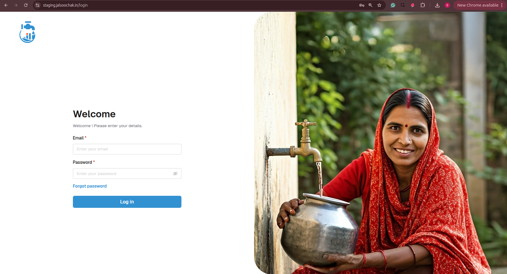

### 1.2 Forgot Password

If you cannot remember your password:

1. On the Login page, click the **Forgot Password** link below the Login button.
2. A modal dialog opens. Enter your registered **Email Address**.
3. Click **Send Reset Link**.
4. Upon success, a confirmation message is shown. Check your inbox for a password reset email.
5. Click **Close** (or the X button) to dismiss the modal.

> **Note:** *If you do not receive the email within a few minutes, check your spam/junk folder.*

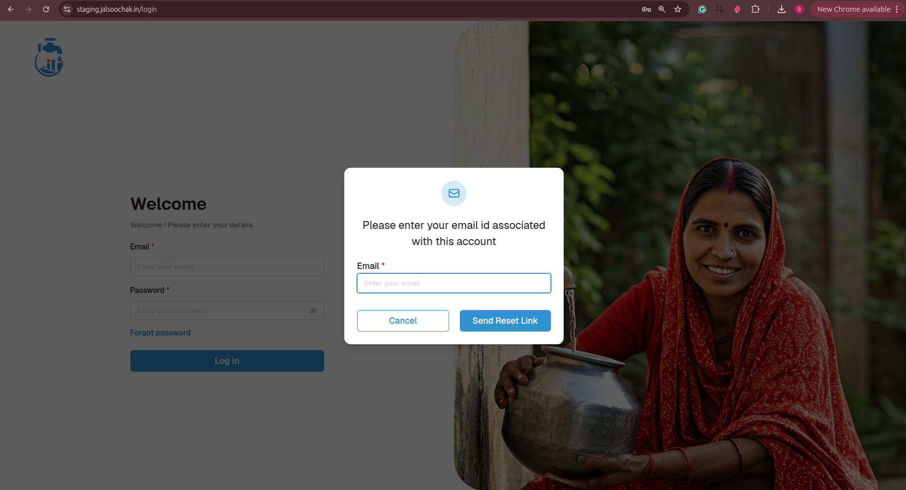

### 1.3 Reset Password

**Route:** `/resetpassword?token=<token>` (accessed via the link in the reset email)

1. Click the reset link in the email you received.
2. On the Reset Password page, enter your **New Password**.
3. Re-enter the same password in the **Confirm Password** field.
   * Click the eye icon on either field to toggle visibility.
4. Click **Reset Password**.

**Validation rules:**

* Both fields must match.
* Password must meet the minimum strength requirements shown on screen.

If the reset link has expired or is invalid, an error message is shown. You must repeat the Forgot Password process to get a new link.

### 1.4 Account Activation (First Login)

**Route:** `/createpassword` (accessed via the invite email)

When a Super User invites you, you receive an email with an activation link.

1. Click the activation link in the email.
2. On the Create Password page, enter a **New Password**.
3. Re-enter the password in the **Confirm Password** field.
4. Click **Activate Account** (or equivalent submit button).

After activation you can log in with your email and newly created password.

### 1.5 Change Password

**Route:** `/change-password` (accessible from account/profile settings)

1. Navigate to Change Password from the account menu.
2. Enter your **Current Password**.
3. Enter a **New Password**.
4. Re-enter the new password in the **Confirm New Password** field.
5. Click **Save**.

### 1.6 Logging Out

Click your profile/avatar in the top-right corner and select **Logout**. You are redirected to the Login page.

## 2. Navigation Overview

After logging in, the left sidebar provides access to all State Admin sections:

| Sidebar Item        | Description                                          |
| ------------------- | ---------------------------------------------------- |
| **Overview**        | Summary stats, setup wizard status, API token        |
| **Configuration**   | Channels, reasons, location, maps, time, formats, logo |
| **Hierarchy**       | LGD and department hierarchy level names             |
| **Language**        | Primary, secondary, and tertiary language selection  |
| **Water Norms**     | LPCD standards and supply thresholds                 |
| **Escalations**     | Escalation schedule and level day thresholds         |
| **Templates**       | View message templates per language and screen       |
| **Data Management** | Expandable group containing three sub-items:         |
| — Staff             | Upload and browse field staff                        |
| — Schemes           | Upload and browse water schemes                      |
| — Scheme Mappings   | Upload and browse scheme ID mappings                 |
| **State/UT Admins** | Invite and manage state-admins                       |

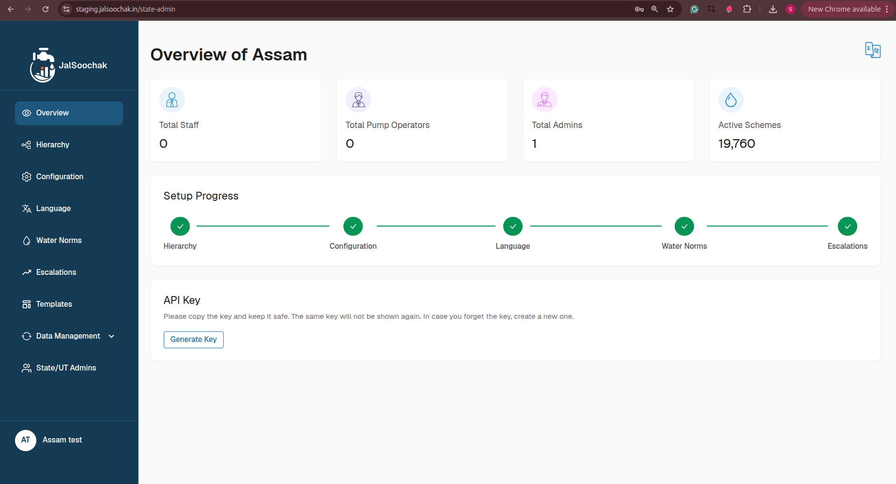

## 3. Overview Page

**Route:** `/state-admin`

The Overview is the landing page after login. It provides a snapshot of the state's data and setup progress.

### 3.1 Statistics Cards

Four summary cards are displayed:

| Card                 | What It Shows                            |
| -------------------- | ---------------------------------------- |
| Total Staff          | Total number of field staff registered   |
| Total Pump Operators | Count of pump operator accounts          |
| Total Admins         | Count of admin accounts                  |
| Active Schemes       | Number of currently active water schemes |

These values are read-only and updated automatically.

### 3.2 Configuration Setup Wizard

Displays the completion status of the five required setup steps:

* Configuration
* Language
* Water Norms
* Escalations

Each step shows a tick if completed, or a pending indicator if not yet saved. Click any incomplete step to go directly to that page.

### 3.3 API Token Management

Located at the bottom of the overview page.

| Action               | How To                                                                  |
| -------------------- | ----------------------------------------------------------------------- |
| **Generate API Key** | Click the **Generate Key** button. The key appears in the field below. |
| **View / Hide Key**  | Click the eye icon next to the key field to toggle visibility.          |
| **Copy Key**         | Click the copy icon to copy the key to your clipboard.                  |

> **Warning:** *Treat the API key like a password. Do not share it. If compromised, regenerate it — the old key will be invalidated.*

## 4. Configuration Page

**Route:** `/state-admin/configuration`

This page controls core operational settings for your state.

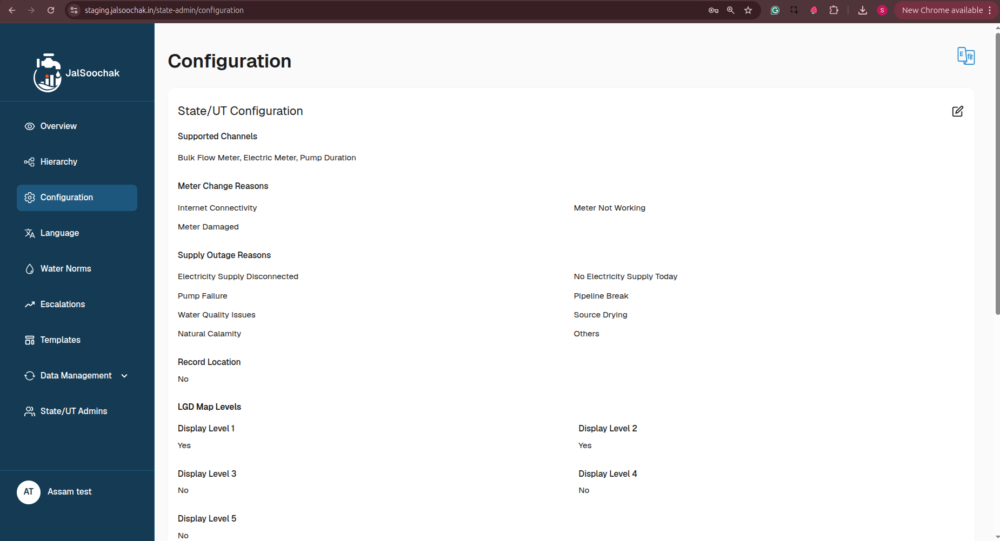

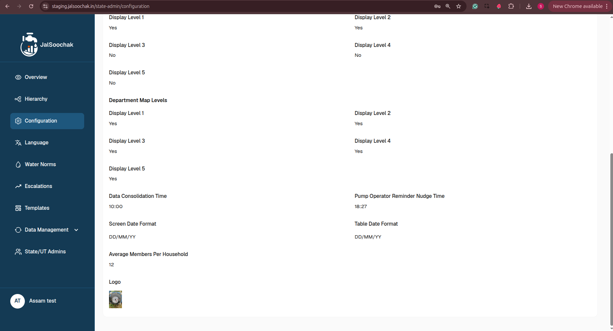

### 4.1 Viewing the Current Configuration

The page opens in **View Mode** by default. All current settings are displayed as read-only text.

### 4.2 Editing the Configuration

1. Click the **Edit** button (pencil icon) in the page header.
2. The form becomes editable.
3. Make your changes (see fields below).
4. Click **Save** (or **Save Changes** if previously configured).
5. Click **Cancel** to discard changes and return to View Mode.

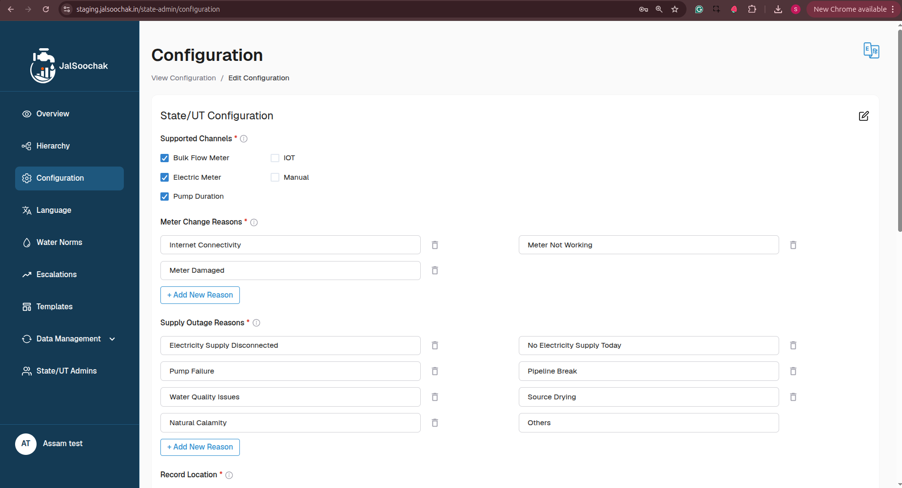

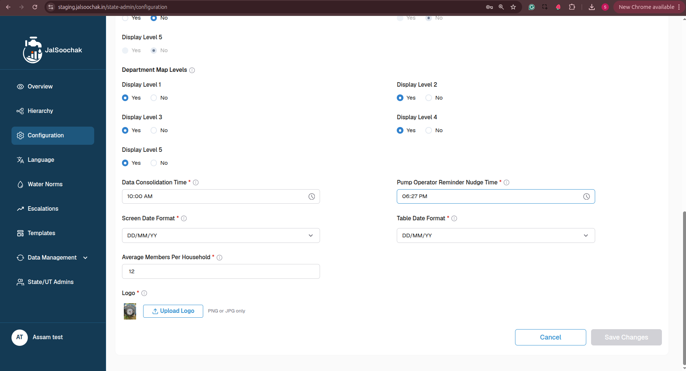

### 4.3 Configuration Fields

**Supported Channels**

* A checkbox grid listing all available communication channels.
* Check all channels your state will use.
* Channels that have been removed by Super User appear disabled with a warning icon.
* At least one channel must be selected.

**Meter Change Reasons**

* A list of reasons shown to field staff when recording a meter change.
* **Add a reason:** Click **Add New Reason**, type the reason text (max 100 characters), and confirm.
* **Edit a reason:** Click the edit icon on any row, update the text, and save.
* **Delete a reason:** Click the delete icon on any row. Confirm the deletion.
* Duplicate reason names are not allowed.

**Supply Outage Reasons**

* Same interface as Meter Change Reasons.
* Lists reasons shown when a supply outage is reported.

**Record Location Check**

* Toggle whether field staff must verify their GPS location during data entry.
* Select **Yes** or **No**.

**Department Map Levels** *(visible only when Display Department Maps = Yes)*

* Up to 6 map levels (Level 1 through Level 6).
* Toggle each level **Yes** or **No**.
* Disabling a level automatically disables all levels below it.

**LGD Map Levels** *(visible only if LGD hierarchy is configured)*

* Same behaviour as Department Map Levels.

**Data Consolidation Time**

* The daily time at which data is aggregated.
* Click the time field and select hours and minutes.

**Pump Operator Reminder Nudge Time**

* The time at which daily reminders are sent to pump operators.
* Click the time field and select hours and minutes.

**Screen Date Format**

* Select the date format displayed on all screens (e.g., DD/MM/YYYY).

**Table Date Format**

* Select the date format used inside data tables.

**Average Members Per Household**

* Enter an integer between 0 and 20.

**Logo Upload**

* Displays the current state logo if one exists.
* Click **Upload** to select a new image file.
* Accepted formats: PNG, JPEG.
* Maximum file size: 2 MB.
* A preview of the selected image is shown before saving.

> **Note:** *On first save, the system will automatically navigate you to the Language page to continue the setup wizard.*

## 5. Hierarchy Page

**Route:** `/state-admin/hierarchy`

Defines the name of each administrative level within LGD and Department hierarchies.

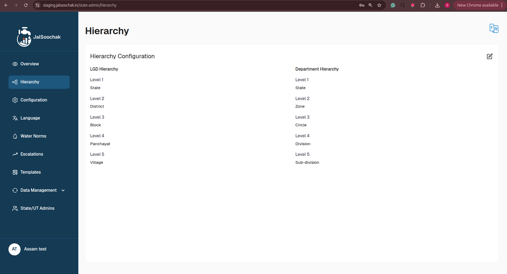

### 5.1 Viewing the Hierarchy

Page opens in View Mode showing a two-column grid:

* **Left column:** LGD Hierarchy levels and their names
* **Right column:** Department Hierarchy levels and their names

### 5.2 Editing the Hierarchy

1. Click the **Edit** button.
2. Both columns become editable simultaneously.
3. For each level, update the **Level Name** in the text field (max 50 characters).
4. If structural changes are permitted:
   * Click **Add Level** to append a new level at the bottom.
   * Click the delete icon on a level row to remove it.
5. Click **Save Changes** when done.
6. Click **Cancel** to discard changes.

**Validation:**

* All level names are required.
* Duplicate level names within the same hierarchy are not allowed.

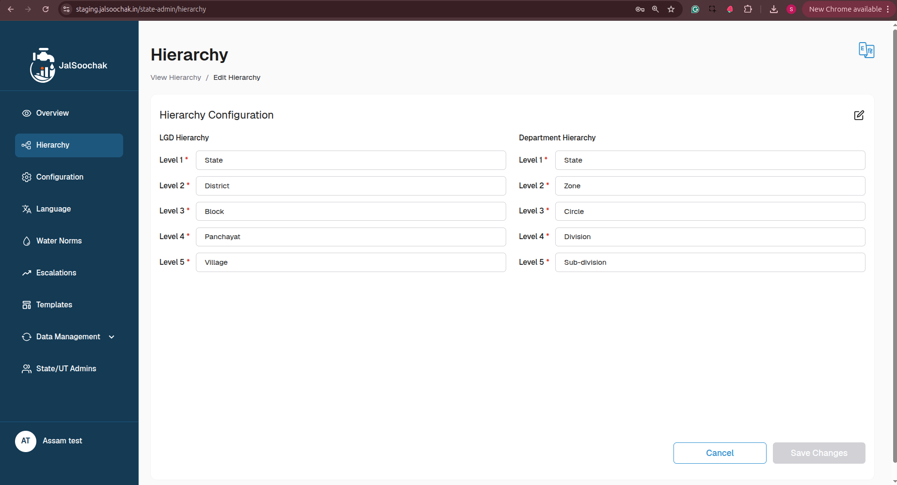

## 6. Language Page

**Route:** `/state-admin/language`

Selects which languages the platform will support for this state.

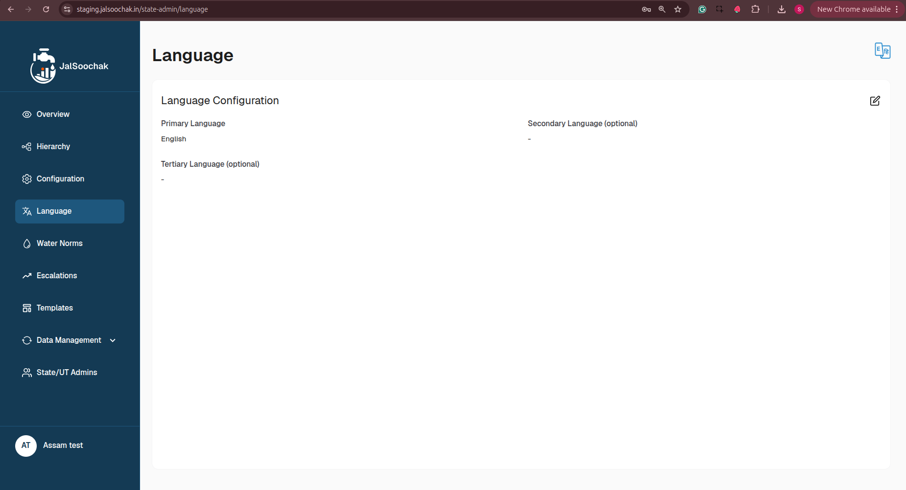

### 6.1 Viewing Languages

Page opens in View Mode showing:

* Primary Language (required)
* Secondary Language (optional)
* Tertiary Language (optional)

### 6.2 Editing Languages

1. Click the **Edit** button.
2. Use the searchable dropdown for each language slot.
   * Type to filter the list.
   * Click a language to select it.
3. A language selected for one slot is removed from the options of the other slots automatically.
4. Click **Save Changes**.
5. Click **Cancel** to discard.

**Rules:**

* Primary Language is mandatory.
* Secondary and Tertiary are optional but cannot duplicate the primary or each other.

> **Note:** *On first save, the system will navigate you to the Water Norms page to continue the setup wizard.*

## 7. Water Norms Page

**Route:** `/state-admin/water-norms`

Sets the standard water supply quantity and deviation thresholds for the state.

### 7.1 Viewing Water Norms

Page opens in View Mode showing:

* State standard quantity (LPCD)
* Undersupply and oversupply alert thresholds

### 7.2 Editing Water Norms

1. Click the **Edit** button.
2. Fill in or update the fields below.
3. Click **Save Changes**.
4. Click **Cancel** to discard.

**Fields:**

**Standard Quantity (LPCD)**

* Enter the state-wide litres per capita per day (LPCD) norm.
* Valid range: 0 – 1000.
* Required field.

**Undersupply Threshold (%)**

* The negative deviation (below the norm) that triggers an undersupply alert.
* Enter a percentage (0 – 100).

**Oversupply Threshold (%)**

* The positive deviation (above the norm) that triggers an oversupply alert.
* Enter a percentage (0 – 1000).

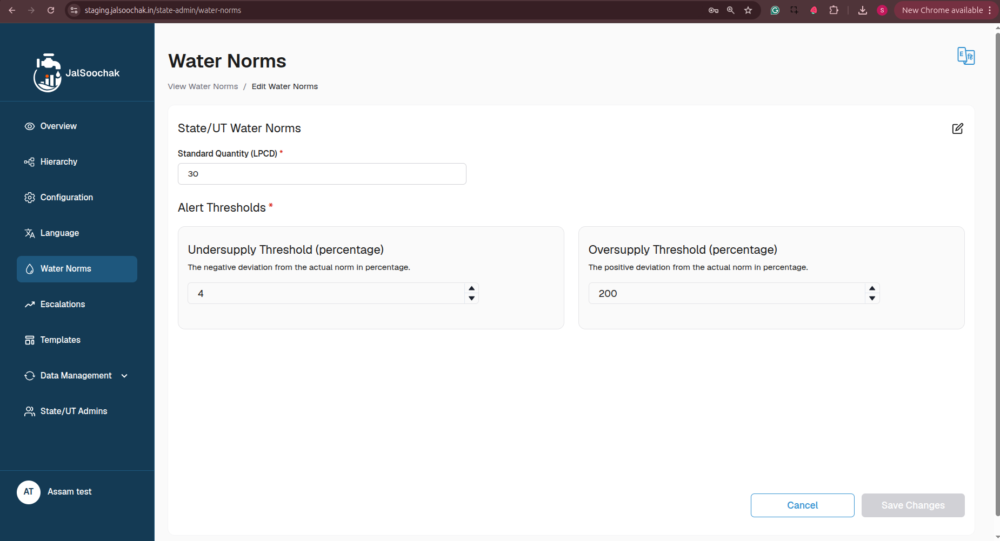

## 8. Escalations Page

**Route:** `/state-admin/escalations`

Configures the automatic escalation schedule and day thresholds for unresolved issues.

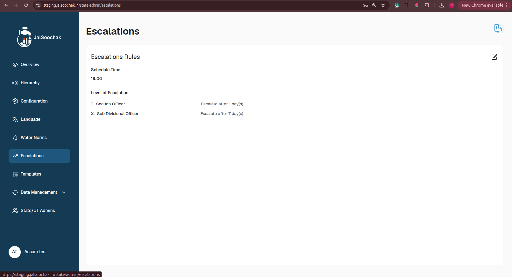

### 8.1 Viewing Escalations

Page opens in View Mode showing the current schedule time and day thresholds for each escalation level.

### 8.2 Editing Escalations

1. Click the **Edit** button.
2. Update the fields below.
3. Click **Save Changes**.
4. Click **Cancel** to discard.

**Fields:**

**Schedule Time**

* The time of day when the system checks for issues to escalate.
* Select hours and minutes from the time picker.

**Level 1 — Section Officer**

* Enter the number of days after which an unresolved issue is escalated to the Section Officer.
* Valid range: 1 – 365.

**Level 2 — Sub Divisional Officer (SDO)**

* Enter the number of days after which the issue is further escalated to the SDO.
* Valid range: 1 – 365.
* Must be greater than or equal to the Level 1 threshold.

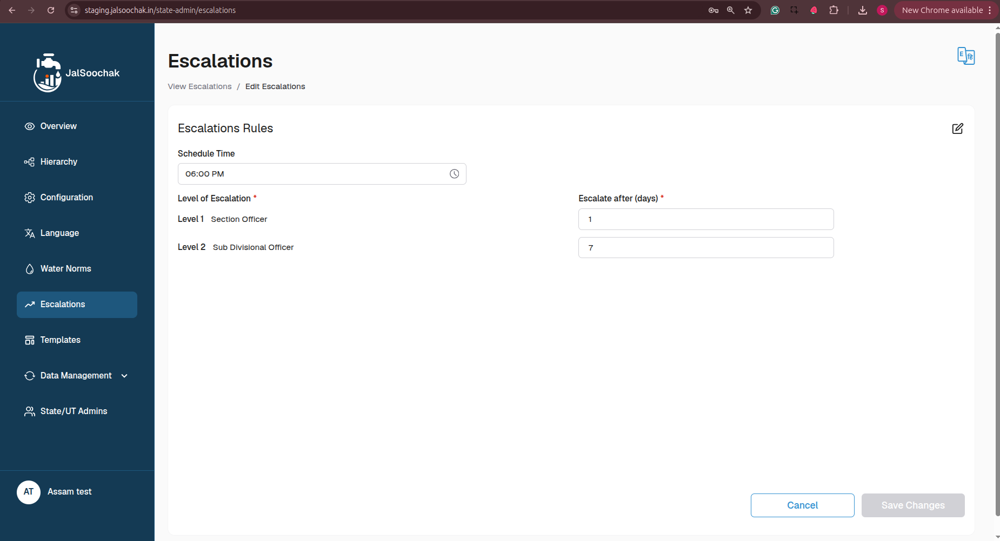

## 9. Message Templates Page

**Route:** `/state-admin/templates`

Allows you to view the message templates that are sent to field staff through supported channels.

> *This page is **read-only**. Templates are managed by the Super Admin.*

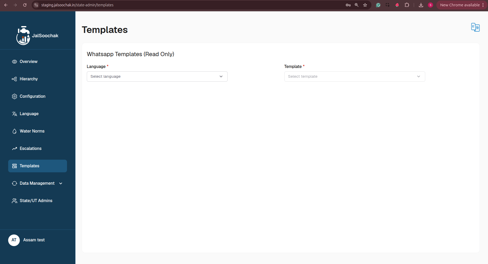

### 9.1 Viewing a Template

1. Select a **Language** from the Language dropdown.
2. Select a **Screen** from the Screen dropdown (the specific workflow screen the message relates to).
3. The template content for that combination is displayed:
   * **Prompt** — the instruction shown to the field worker.
   * **Message** — the text sent via the chosen channel.
   * **Confirmation Template** — the confirmation message text.
   * **Options** — list of selectable options (if applicable).
   * **Reasons** — list of selectable reasons (if applicable).

Changing the Language dropdown resets the Screen selection.

## 10. Data Management

The Data Management section contains three sub-pages for uploading master data files into the system. Click the **Data Management** item in the sidebar to expand it, then select the relevant sub-page.

### 10.1 Staff

**Route:** `/state-admin/staff-sync`

Manage field staff records: pump operators, section officers, and sub-divisional officers.

**Summary Cards**

Three cards at the top show:

* Total Pump Operators
* Total Section Officers
* Total Sub Divisional Officers

**Filtering Staff**

| Filter | Options                                                  |
| ------ | -------------------------------------------------------- |
| Search | Type a name — results filter by full name                |
| Role   | Pump Operator / Section Officer / Sub Divisional Officer |
| Status | Active / Inactive                                        |

Clear a filter by resetting the dropdown to its default value.

**Staff Table**

Columns: **Name** | **Phone** | **Email** | **Role** | **Status** | **Actions**

* Click any sortable column header to sort ascending; click again for descending.
* Use the rows-per-page selector (10 / 25 / 50) and pagination arrows at the bottom.

**Upload Staff Data**

1. Click the **Upload Data** button.
2. In the modal, click **Choose File** and select a CSV or Excel file.
3. Click **Upload**.
4. The system validates the file and imports records. Any errors are displayed in the modal.

**Broadcast to Staff**

1. Click the **Broadcast** button.
2. In the modal, select the broadcast message template , the roles to send and time period(message will be sent to all on-boarded in this time frame).
3. Confirm and send.

Download report

1. Click on Download button.
2. Report will download.

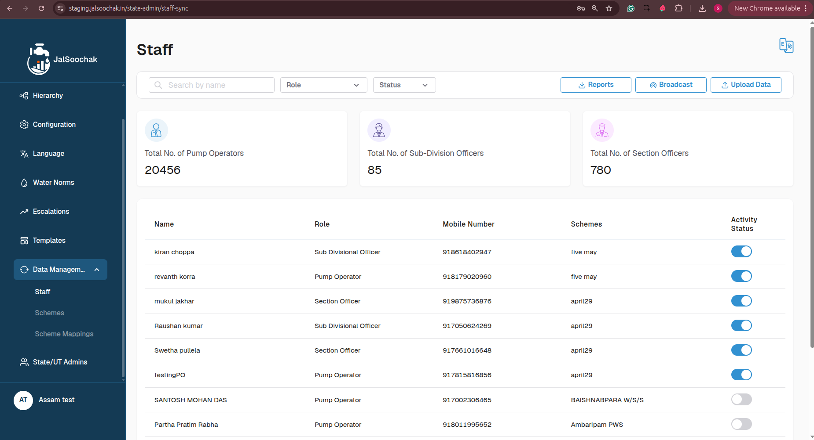

### 10.2 Schemes

**Route:** `/state-admin/scheme-sync`

Manage water scheme records.

**Summary Cards**

Three cards show:

* Total Schemes
* Active Schemes
* Inactive Schemes

**Filtering Schemes**

| Filter           | Options                                        |
| ---------------- | ---------------------------------------------- |
| Search           | Type a scheme name                             |
| Work Status      | Derived from available work status values      |
| Operating Status | Derived from available operating status values |

Click the **Clear Filters** link (when visible) to reset all filters at once.

**Scheme Table**

Columns include: **Scheme Name** | **Work Status** | **Operating Status** | additional metadata columns.

* Sortable columns with ascending / descending / default cycle.
* Pagination: 10 / 25 / 50 rows per page.

**Upload Scheme Data**

1. Click the **Upload Schemes** button.
2. Select a CSV or Excel file in the modal.
3. Click **Upload**.
4. Validation results and any errors are shown in the modal.

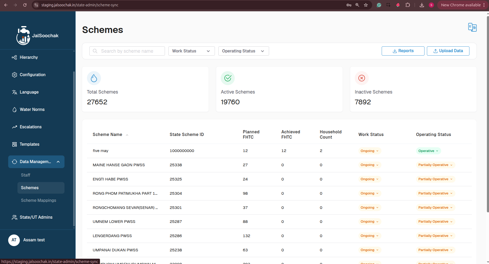

### 10.3 Scheme Mappings

**Route:** `/state-admin/scheme-mappings-sync`

Map state-specific scheme IDs to national scheme IDs.

**Filtering Scheme Mappings**

| Filter | Description        |
| ------ | ------------------ |
| Search | Type a scheme name |

**Scheme Mappings Table**

Columns include: **Scheme Name** | **State Scheme ID** | **National Scheme ID** | additional columns.

* Sortable and paginated (10 / 25 / 50 rows per page).

**Upload Scheme Mapping Data**

1. Click the **Upload Scheme Mappings** button.
2. Select the mapping file (CSV or Excel) in the modal.
3. Click **Upload**.
4. Results and errors are displayed in the modal.

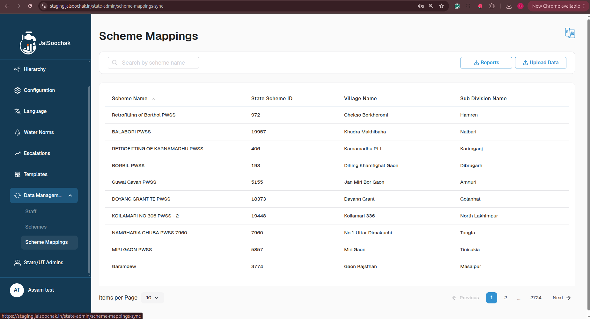

## 11. State/UT Admins

**Route:** `/state-admin/state-ut-admins`

Manage the state-admins (State/UT Admins) of your state.

### 11.1 View Admin List

The list page shows all current State/UT Admins.

**Filtering Admins**

| Filter | Options                                    |
| ------ | ------------------------------------------ |
| Search | Name, email, or phone number               |
| Status | All Statuses / Active / Inactive / Pending |

**Admin Table**

Columns: **Name** | **Mobile Number** | **Email Address** | **Status** | **Actions**

* Sortable columns, pagination: 10 / 25 / 50 rows per page.
* **Status badges:**
  * Active — admin has accepted the invite and is active.
  * Pending — invite sent but not yet accepted.
  * Inactive — admin has been deactivated.

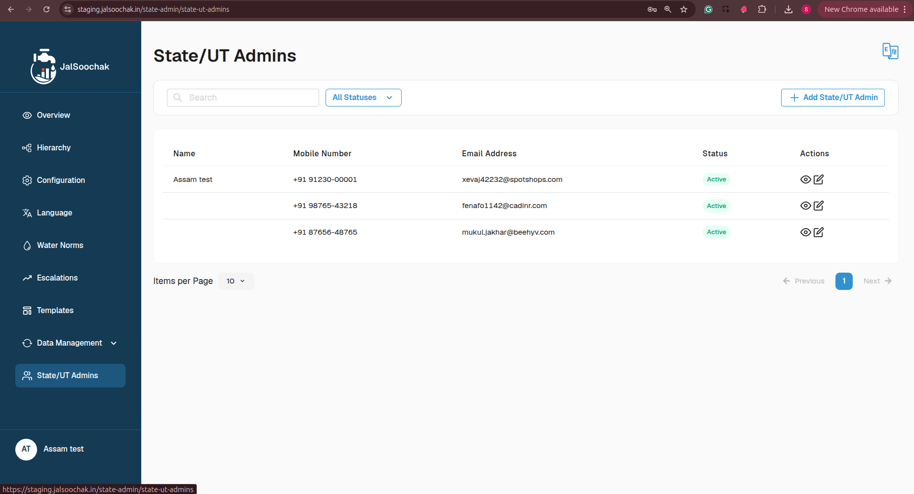

### 11.2 Invite a New Admin

1. From the Admin List page, click the **Add Admin** button.
2. Fill in the form:

   | Field         | Rules                                                               |
   | ------------- | ------------------------------------------------------------------- |
   | First Name    | Required. Alphabetic characters and spaces only. Max 25 characters. |
   | Last Name     | Required. Alphabetic characters and spaces only. Max 25 characters. |
   | Mobile Number | Required. Exactly 10 digits.                                        |
   | Email Address | Required. Valid email format.                                       |
3. Errors appear under each field after you leave (blur) the field.
4. The **Submit** button is disabled until all fields are valid.
5. Click **Submit** to send the invite. The new admin will receive an activation email.
6. Click **Cancel** to go back to the list without saving.

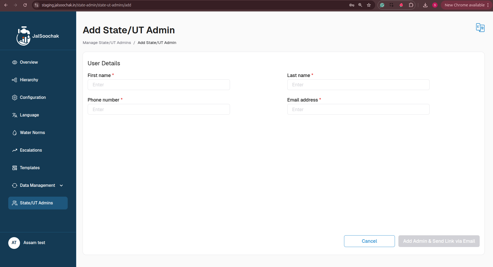

### 11.3 View Admin Details

1. In the Admin List, click the **View** (eye) icon on any row.
2. The detail page shows:
   * First Name
   * Last Name
   * Email Address
   * Phone Number
   * Activation Status
3. Click the **Edit** button in the header to go to the edit form.
4. Use the breadcrumb link to return to the list.

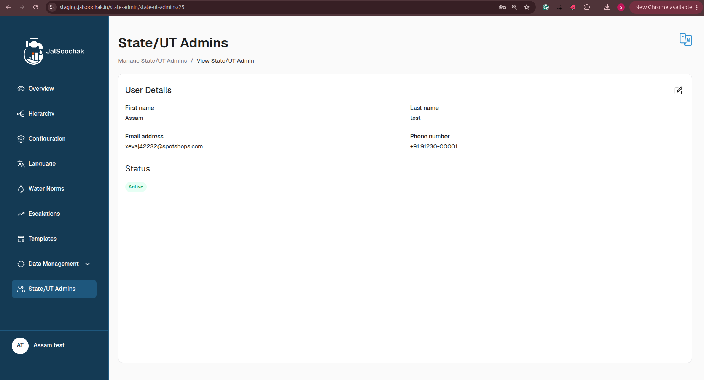

### 11.4 Edit an Admin

1. From the Admin List, click the **Edit** (pencil) icon on any row.

   Alternatively, from the View Detail page, click the **Edit** button.
2. The edit form opens pre-populated with existing data.
3. Update any of the fields (same validation rules as inviting a new admin).
4. Click **Save Changes**.
5. Click **Cancel** to discard changes.

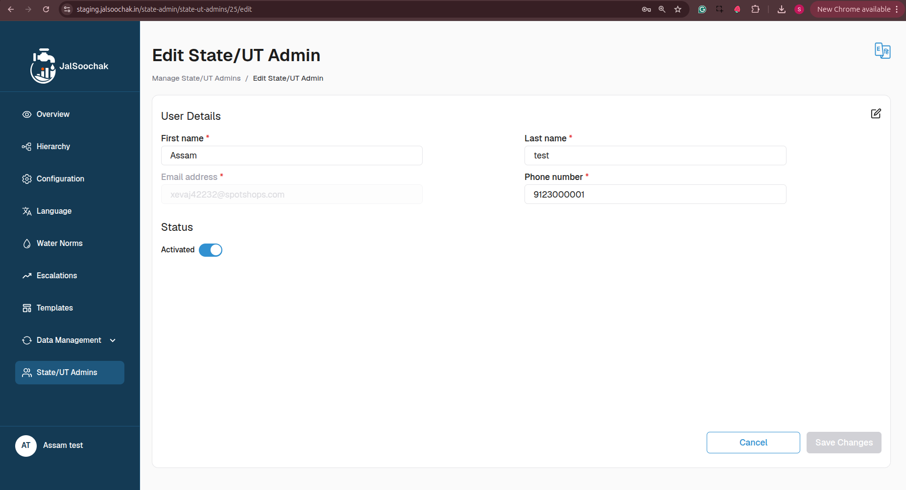

### 11.5 Resend Invite

Available only for admins with **Pending** status (invite sent but not accepted).

1. In the Admin List, find the admin with Pending status.
2. Click the **Resend Invite** (envelope) icon in the Actions column.
3. Confirm the action if prompted.

A new activation email is sent to the admin's registered email address.

## Appendix: Common UI Patterns

**Edit / View Mode Toggle**

Most configuration pages (Configuration, Hierarchy, Language, Water Norms, Escalations) open in **View Mode** and switch to **Edit Mode** when you click the **Edit** button. Changes are only applied when you click **Save Changes**. Clicking **Cancel** discards all unsaved changes.

**Form Validation**

* Fields marked with \* are required.
* Validation runs when you leave a field (on blur).
* Error messages appear in red below the relevant field.
* The Save button may be disabled until all required fields are valid.

**Toast Notifications**

Success and error feedback appears as a brief notification (toast) in the corner of the screen after actions such as saving, uploading, or generating an API key.

**Table Controls**

* Click a column header to sort; click again to reverse sort order; a third click clears the sort.
* The rows-per-page selector and page arrows are located below each table.

**First-Time Setup Wizard**

When performing initial setup, the system guides you through the required pages in order:

1. Configuration
2. Language
3. Water Norms
4. Escalations

Saving each page for the first time automatically navigates you to the next required step. The **Overview** page shows your progress.
